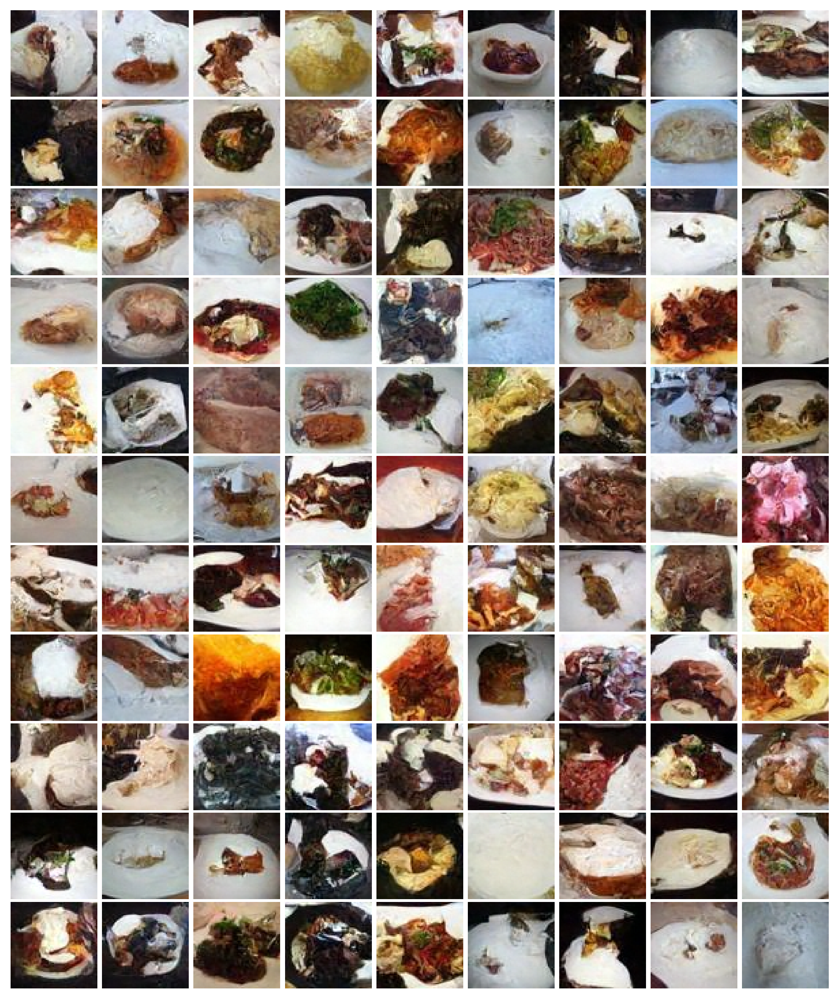

# Проект: Сравнение подходов генерации изображений

Данный проект является результатом лабораторной работы по изучению основных подходов генерации изображений при помощи нейронных сетей. Полученный фреймворк располагает функционалом для обучения, сравнения оценок качества генерации и проведения инференса двух основных стратегий: `состязательных генеративных сетей (GAN)` и `диффузионных моделей (DDPM)`. 

Вместе с основными пайплайнами обучения предлагается ряд модификаций ванильных методов, предназначенных для получения улучшения конечного результата, а так же подробный отчет о всех проведенных экспериментах на базе модификаций, расположенный в дирриктории `./docs`.




## Setup workflow

Для работы с проектом подходит любой из менеджеров of environments. В качестве примера приведем работу с `pipenv` и `conda`

**pipenv**
```
pipenv install
pipenv shell 
pip install -r requirements.txt
```

**conda**
```
conda create -q --name image-gen-prj -c conda-forge python=3.11.10
conda activate image-gen-prj

# install dependancies
conda install pip3
pip3 install --upgrade pip
pip3 install -r requirements.txt  
```

Так же предлагается автоматический setup:

```
sh setup.sh
```

## Пример inference

Проект предлагает предобученные модели, доступные для инференса:

1. Установка предобученных моделей

```
from huggingface_hub import snapshot_download
snapshot_download('Artem-fm/gen-ai-task', local_dir='./checkpoints')
```

2. Примеры инференса могут быть найдены в папке `./scripts/`